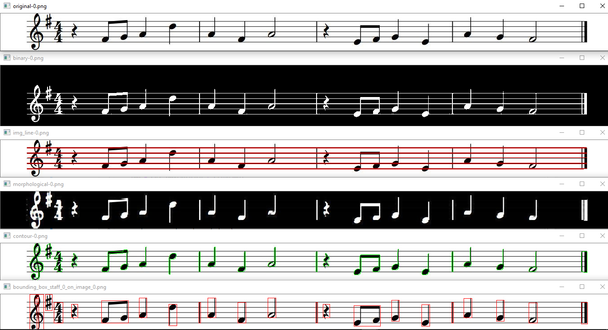

# Crop-Musical-Sheet-OpenCV
 Crop musical sheet to extract music note from sheet using OpenCV and Python
 
 
- convert grayscale image
- convert ke binary image menggunakan metode otsu
- convert ke edge image menggunakan canny edge detector
- remove staff line (timpa aja pakai rectangle putih dengan size distance dari hasil canny)
- connecting nearest gap antar edge menggunakan morphological transformation
- find contour (extream outer contour)
- calculate bounding box contour
- segmenting music note (numpy slicing menggunakan ukuran bounding box contour)

### Result :

